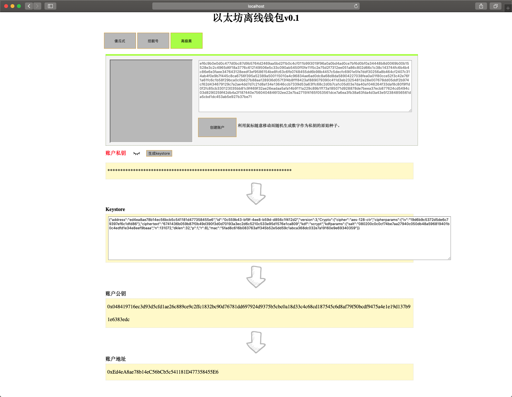

# 以太坊离线钱包

## 功能

1. 傻瓜式：一键随机生成钱包账号。
2. 挖靓号：根据规则查找靓号，如以“2020”开头的账号。
3. 高级黑：使用鼠标移动来随机生成私钥种子。
4. 默认私钥不可见。
5. 支持导出 keystore 文件。

## 项目技术

使用 JQuery 操作网页，来完成 etherjs API 所提供的功能。

## 如何使用

依次下载 src 文件夹下的所有文件后，直接双击打开`index.html`即可使用。

在使用过程中不需要使用互联网。

## 如何参与改进

1. 下载项目。
2. 执行`npm install` 安装依赖包。
3. 执行`npm run dev` 可实时预览项目。
